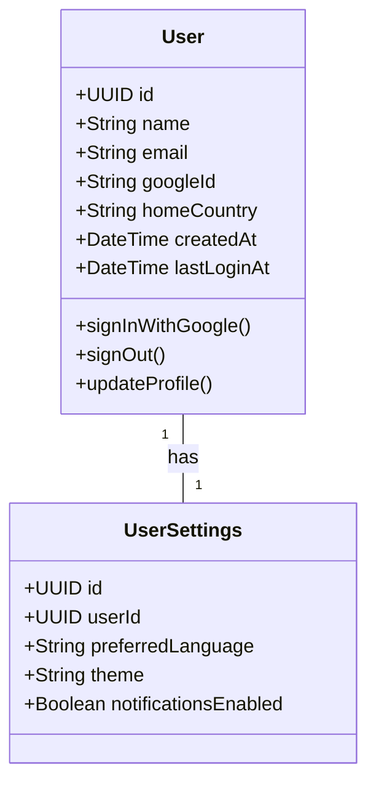

# User & Account

## Description

Models the account a user creates on the Educate login screen (Name, Country,
Sign in with Google). `User` holds identity and the user's home country, which
is collected at sign-up. `UserSettings` holds preferences shown in the
"Settings" section of the app (theme, language, notifications). A user has
exactly one settings record, created when the account is created.
