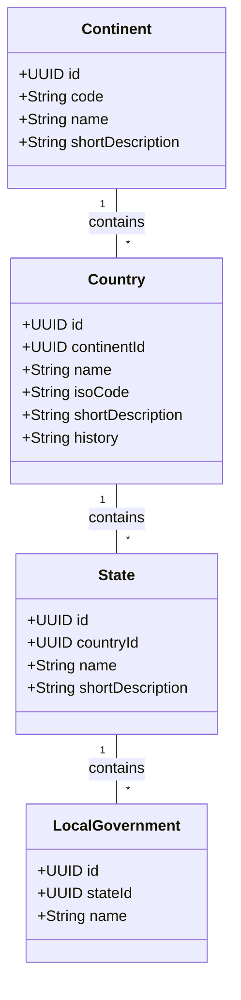

# Geographic Hierarchy

## Description

The backbone of the app's content: a strict containment hierarchy that mirrors
how users drill down through the UI (continent map → country page → state page
→ local government). `Continent.code` holds the two-letter labels shown on the
world map (AF, AS, EU, NA, SA, AN, AU). Each level has its own short
description so the UI can show a summary before the user clicks in. "Province"
in the sketches is treated as a synonym for `State` here.
