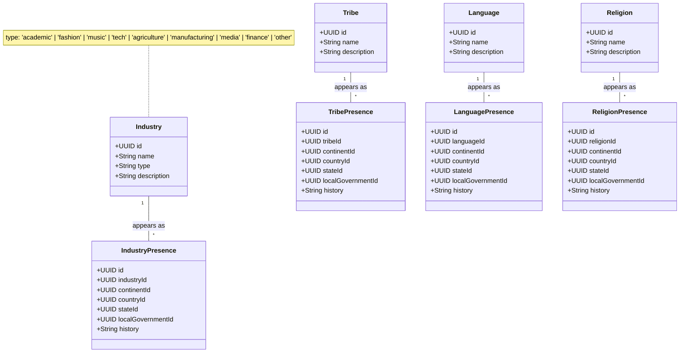

# Cultural Attributes

## Description

There are two layers here:

1. **Catalogue classes** — `Tribe`, `Language`, `Religion`, `Industry`. Each is
   a single canonical record (e.g., one row for "Yoruba", one for "Igala").
   They are reused across many places and never duplicated.

2. **Presence classes** — `TribePresence`, `LanguagePresence`,
   `ReligionPresence`, `IndustryPresence`. Each one attaches a catalogue entry
   to a specific place at a specific geographic level, and carries the
   `history` text for *that level only*.

**How the link to a place works:** every Presence class has four nullable
foreign keys — `continentId`, `countryId`, `stateId`, `localGovernmentId` —
each pointing at the matching table. **Exactly one of the four is filled in
per row**, identifying both *which level* the presence is at and *which
specific place*. The other three stay `NULL`. This is enforced with a `CHECK`
constraint in SQL, so the database rejects rows that set zero or multiple.

So one tribe (say, Yoruba) can have many `TribePresence` rows: one with
`countryId = Nigeria` (country-scoped history), several with
`stateId = Lagos`, `stateId = Oyo`, ... (state-scoped histories), and several
with `localGovernmentId = Ikeja`, ... (LG-scoped histories). The UI assembles
the chain by querying all Presence rows for that tribe and grouping them by
which FK column is set.

**Containment rule (enforced at the application or constraint level, not in
the diagram):** a Presence at a finer level must also exist at all coarser
levels above it. If Yoruba has a `TribePresence` with `stateId = Lagos`, it
must also have one with `countryId = Nigeria` — otherwise the state-level
entry is orphaned. Same rule applies for local-government → state → country
→ continent.

All four attributes share an identical shape — only the `*_id` to the
catalogue table differs — so the SQL tables, indexes, and API endpoints can
follow one template.

**Field-level notes for `Industry`:**

- `type` — one of `'academic'`, `'fashion'`, `'music'`, `'tech'`,
  `'agriculture'`, `'manufacturing'`, `'media'`, `'finance'`, `'other'`. A
  `CHECK` constraint in SQL keeps it to this set. New types are added by
  extending the constraint, not by inserting free-form strings.
