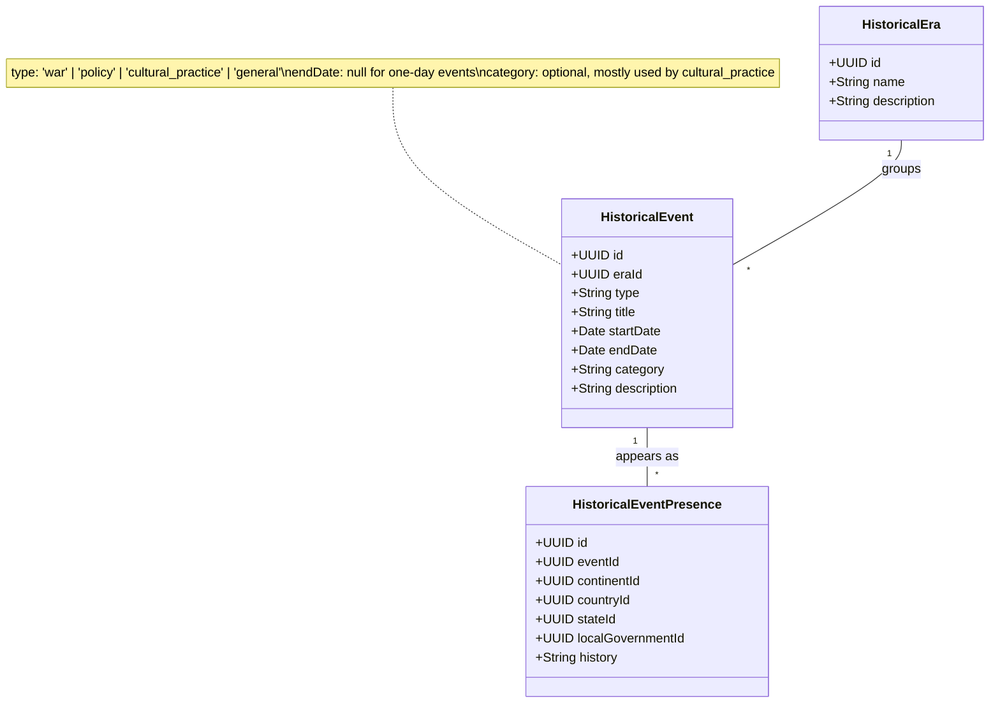

# Historical Content

## Description

This mirrors the Cultural Attributes pattern. There are two layers:

1. **Catalogue class** — `HistoricalEvent`. One canonical record per event or
   topic, grouped under a `HistoricalEra` such as Pre-Colonization or Post-
   Independence. A single `type` column distinguishes wars, policies, cultural
   practices, and generic events; `startDate`/`endDate` handle both single-day
   and multi-day events; `category` is optional metadata used mostly by
   cultural practices (e.g., "food", "ritual", "dress").

2. **Presence class** — `HistoricalEventPresence`. Attaches one event to a
   specific place at a specific geographic level and carries the `history`
   text for *that level only*. So one event (e.g., "Nigerian Civil War") can
   have multiple Presence rows: one with `continentId = Africa` for broad
   context, one with `countryId = Nigeria` for the national account, several
   state-level rows, and so on.

**How the place link works.** `HistoricalEventPresence` has four nullable
foreign keys — `continentId`, `countryId`, `stateId`, `localGovernmentId` —
and exactly one is filled in. The chosen column tells you both the level
and the specific place. A `CHECK` constraint in SQL enforces the "exactly
one" rule.

**Field-level notes for `HistoricalEvent`:**

- `type` — one of `'war'`, `'policy'`, `'cultural_practice'`, `'general'`. A
  `CHECK` constraint in SQL keeps it to this set.
- `endDate` — null for one-day events (use `startDate` only).
- `category` — optional, mostly used by cultural practices.

**Containment rule (enforced at the application or constraint level, not in
the diagram):** a Presence at a finer level should also exist at all coarser
levels above it. If the Nigerian Civil War has a Presence at `stateId = Lagos`,
it should also have one at `countryId = Nigeria` — otherwise the state-level
entry is orphaned.
