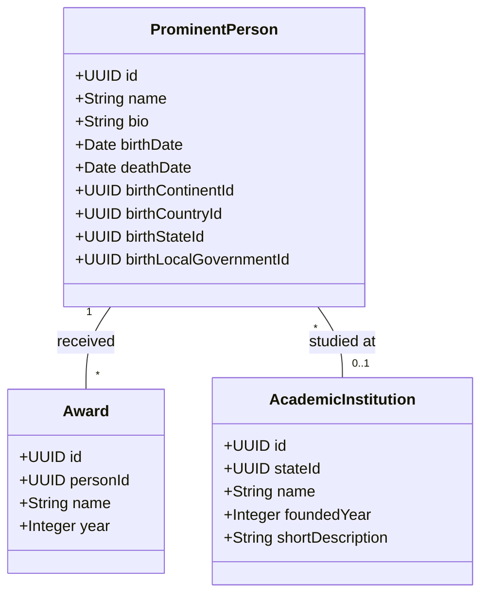

# People & Institutions

## Description

Models the "Prominent People" and "Prominent Academic Institutions" panels in
the state-level sketches (Wole Soyinka, Unilag).

**Birthplace link.** `ProminentPerson` has four nullable foreign keys for
birthplace — `birthContinentId`, `birthCountryId`, `birthStateId`,
`birthLocalGovernmentId` — and exactly one is filled in. The chosen column
tells you both the level of precision recorded (sometimes you only know the
country, sometimes the LG) and the specific place. A `CHECK` constraint in
SQL enforces the "exactly one" rule.

`Award` is its own class so one person can have many. `AcademicInstitution`
is anchored to a single `State` with a normal foreign key, since institutions
always sit in one specific state.
