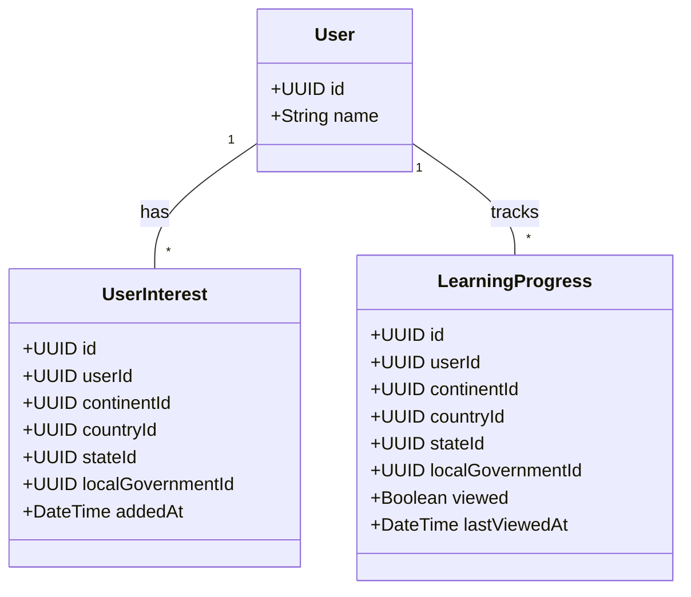

# User Interests & Learning Progress

## Description

Connects a `User` to the geographic entities they care about. `UserInterest`
backs the "My Interests" section in the sidebar (e.g., Africa → Nigeria,
America) — the continents and countries the user picked after login.
`LearningProgress` backs "My Learning" by recording which pages the user has
actually viewed, and when.

**Place link.** Both classes have four nullable foreign keys — `continentId`,
`countryId`, `stateId`, `localGovernmentId` — and exactly one is filled in
per row. The chosen column identifies both the level (continent, country,
state, or local government) and the specific place. A `CHECK` constraint in
SQL enforces the "exactly one" rule, so a single row can point at any level
of the geographic hierarchy without needing a separate table per level.
